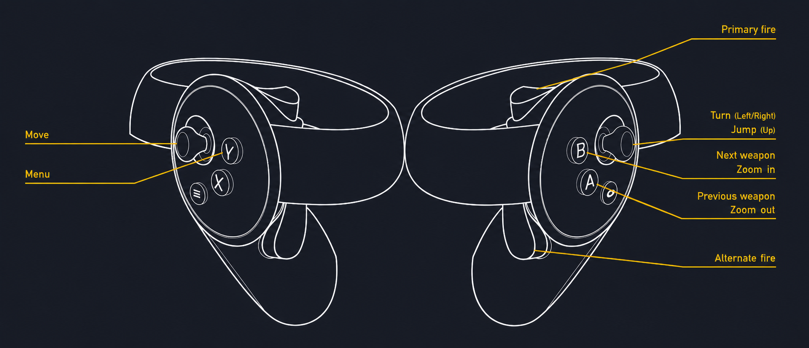

# PainKiller VR Mod

This mod adds native VR (Virtual Reality) support using the OpenXR API to the original *PainKiller* video game developed by *People Can Fly* and published by *DreamCatcher*.

## Requirements

The mod requires the latest version (1.64) of *PainKiller* (*PainKiller: Heaven’s Got a Hitman*) and/or *PainKiller: Battle Out of Hell* video games.

It was tested only with [*PainKiller: Black Edition* on Steam](https://store.steampowered.com/app/39530), a Meta Quest 2 headset, and [Virtual Desktop](https://vrdesktop.net), but it is expected to work with other OpenXR-compatible VR headsets and runtimes.

## Install

1. Download the [ZIP archive with the mod](https://github.com/FluorescentHallucinogen/painkiller-vr-mod/releases/latest/download/painkiller-vr-mod_0.1.2.zip).

2. Place the `*.exe` and `*.dll` files from the ZIP archive’s `/Bin` directory into the game’s `/Bin` directory.

## Enable

1. Open the `/Bin/config.ini` file in any text editor.

2. Add the `Cfg.VideoVR = true` line and save the file.

## Controls

## Notes

This mod is compatible with other mods that do not modify the game’s executable files.

## Plays well with

[PainKiller Advanced Cheats](https://github.com/FluorescentHallucinogen/PainCheats)

## See also

[PainKiller SBS (Side-by-Side) Stereo Mod](https://github.com/FluorescentHallucinogen/painkiller-sbs-stereo-mod)
